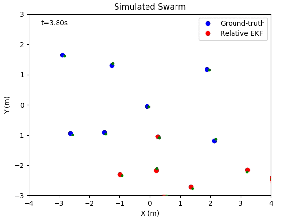

# Relative localization of a swarm flying robots

This project contains simulation code and real-world dataset to show the relative localization performance between multiple robots. This simulation is built in Python, which supports both animation and figure plot.

  
  

Paper: [PDF on arXiv](https://arxiv.org/pdf/2003.05853.pdf).

Video: [Real-world flight on Youtube](https://www.youtube.com/playlist?list=PL_KSX9GOn2P9sgaX3DHnPsnBCJ76fLNJ5).

Quadrotor's code: [Github link](https://github.com/shushuai3/cf_onboard_swarm/tree/swarm).

## Requirements

 - Python 3.x
 - matplotlib
 - numpy
 - csv
 - statistics

## Quick start
    $ git clone https://github.com/shushuai3/multi-robot-localization
    $ cd multi-robot-localization
#### Show animation
    $ python3 main_simulation.py
#### Plot figure: change 'show_animation = True' to 'show_animation = Flase' in main_simulation.py

## Dataset format

#### Dataset files with noise-free distance measurement.
 - /dataset/dat01.csv: 3 crazyflie
 - /dataset/dat02.csv: 3 crazyflie
 - /dataset/dat03.csv: 4 crazyflie

#### Dataset files with noise distance measurement.
 - /dataset/dat01old.csv: 3 crazyflie & 160-second flight
 - /dataset/dat02old.csv: 3 crazyflie & 120-second flight
 - /dataset/dat03old.csv: 4 crazyflie & 160-second flight
 - /dataset/dat04old.csv: 4 crazyflie & 160-second flight

#### 0-9 columns
timetick(ms) | velocity_x_robot0(m/s) | velocity_y_robot0(m/s) | yawRate_robot0(rad/s) | height_robot0(m) | distance_robot0_to_robot0(m) | distance_robot0_to_robot1(m) | distance02(m) | distance03(m) | distance04(m) |
#### 10-45 columns
vx1(m/s) | vy1(m/s) | r1(rad/s) | h1(m) | d10(m) | d11(m) | d12(m) | d13(m) | d14(m) |
vx2(m/s) | vy2(m/s) | r2(rad/s) | h2(m) | d20(m) | d21(m) | d22(m) | d23(m) | d24(m) |
vx3(m/s) | vy3(m/s) | r3(rad/s) | h3(m) | d30(m) | d31(m) | d32(m) | d33(m) | d34(m) |
vx4(m/s) | vy4(m/s) | r4(rad/s) | h4(m) | d40(m) | d41(m) | d42(m) | d43(m) | d44(m) |
#### 46-52 columns
posX_robot0_optiTrack(m) | posY_robot0_optiTrack(m) | posZ_robot0_optiTrack(m) | quaternion1_robot0_optiTrack | quaternion2_robot0_optiTrack |quaternion3_robot0_optiTrack | quaternion4_robot0_optiTrack |
#### 53-81 columns
x1opti | y1opti | z1opti | q1Rob1 | q2Rob1 | q3Rob1 | q4Rob1 |
x2opti | y2opti | z2opti | q1Rob2 | q2Rob2 | q3Rob2 | q4Rob2 |
x3opti | y3opti | z3opti | q1Rob3 | q2Rob3 | q3Rob3 | q4Rob3 |
x4opti | y4opti | z4opti | q1Rob4 | q2Rob4 | q3Rob4 | q4Rob4 |